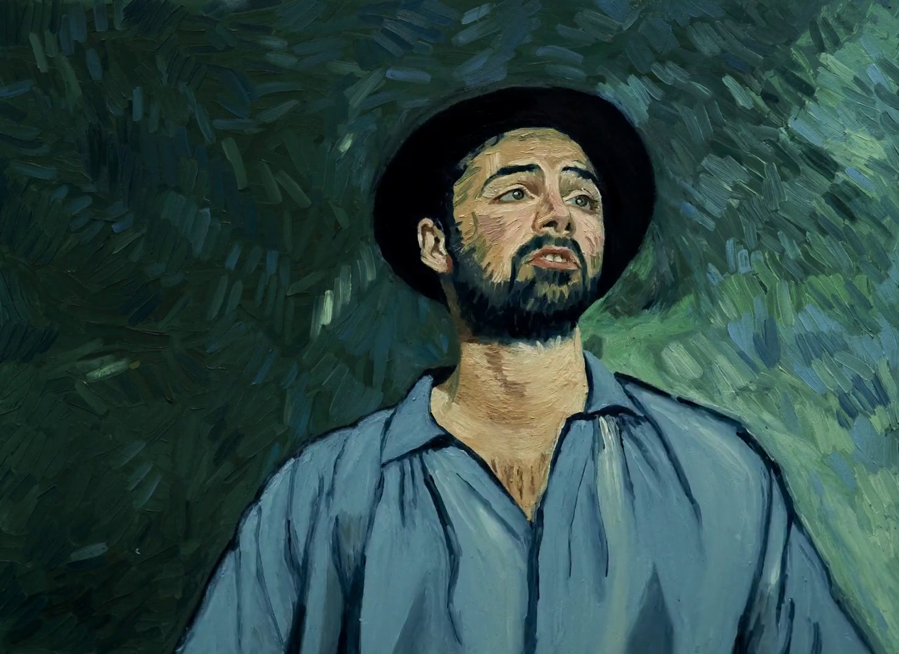
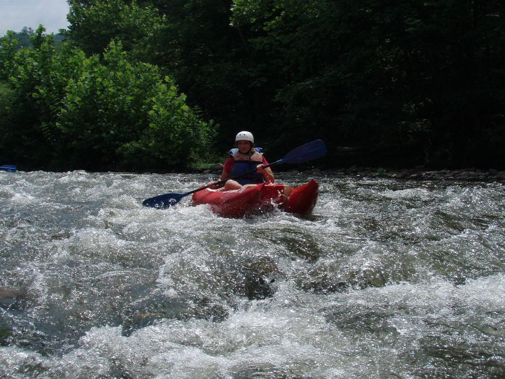
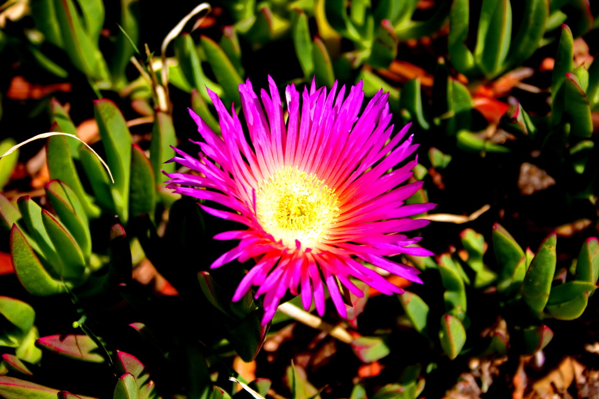
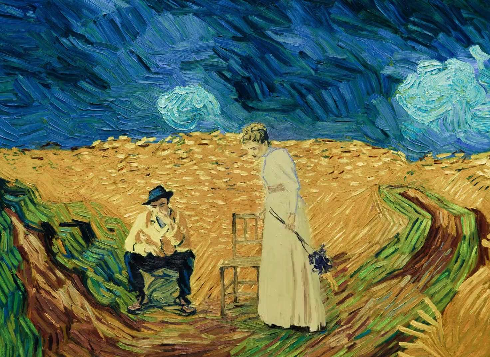
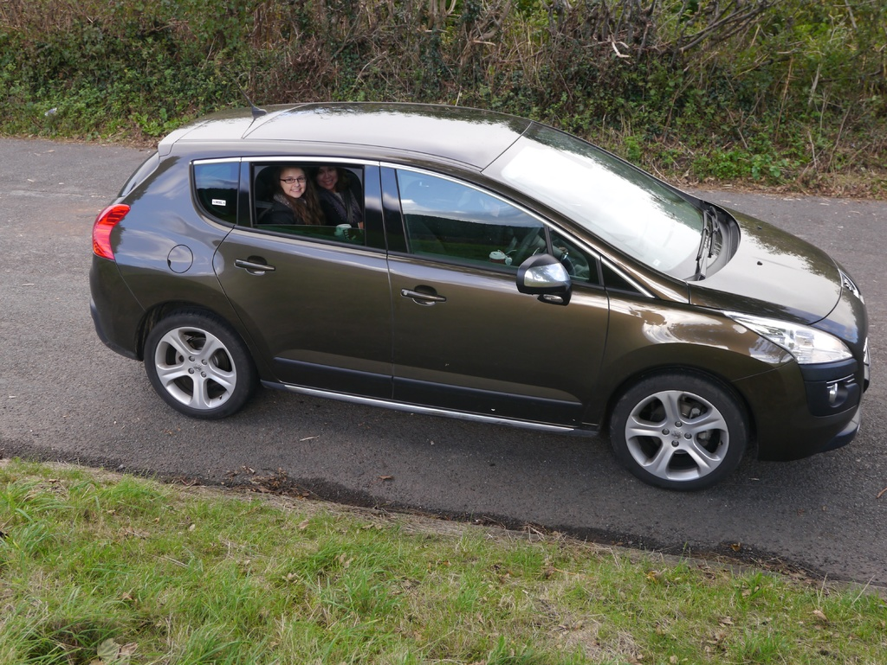

# GOGH

This is an implementation of CycleGAN (and similar papers) in an attempt to translate photos to the style of Vincent Van Gogh.

### Tasklist:

- [x] Create Dataset (Remove black and white scenes and duplicate frames)
- [ ] Get the pipeline running on a trivial image size and trivial network size
- [ ] Round out metrics and Weights and Biases graphics
- [ ] Increase network size to get passable results
- [ ] Increase image size to get beautiful results

## Dataset

I'll be translating from an openImages dataset to a dataset I created from the film Loving Vincent.
I chose openImages because it is extremely diverse and all photography.
Loving Vincent is an amazing film in that all the frames are hand-painted. Of course they're not painted by Van Gogh himself, but the style is on point.
All the frames are the same size and scale too, so it's a very clean dataset. It's easy to work with.

#### Samples:
Loving Vincent |  openImages
:-------------------------:|:-------------------------:
  |  
  |  
  |  

